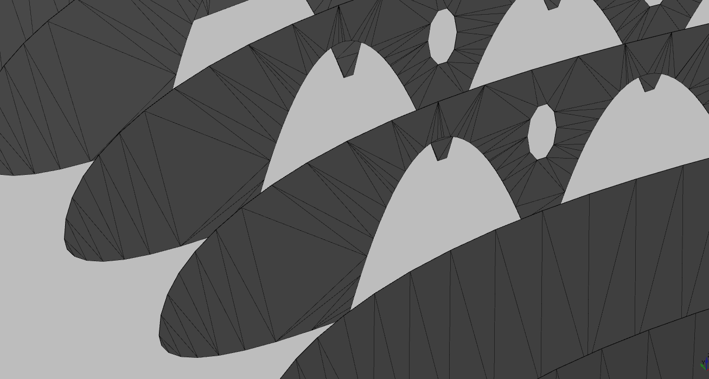

# poly_tri

uses [1] for triangle creation and adds triangle deletion for holes and non convex geometry.

TODO: make it faster (c++, cython, pypy)


## minimal example:
```
from tpoly_tri import PolyTri
import numpy as np
pts = np.array([[-1, 0], [1, 0], [0., 0.5], [0., -0.5]])
edge = [[0, 1]]
tri = PolyTri(pts, edge, remove_holes=False, delaunay=False)
triangles = tri.get_tris()
```


## example usage:



[1] https://code.activestate.com/recipes/579021-delaunay-triangulation/
